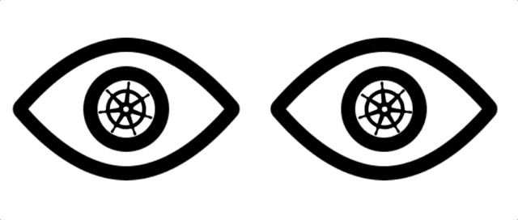

# i

<br />
<p align="center"><a href="#" target="_blank" rel="noopener noreferrer"></a></p>
<h1 align="center">i</h1>
<br />

>  i is an Kubernetes Operator for restarting old pod policies management.

[](https://github.com/ellerbrock/open-source-badges/)
[![Go][go-badge]][go]
[![License][license-badge]][license]

[![GoDoc][godoc-badge]][godoc]
[![GolangCI][golangci-badge]][golangci]
[![Go Report Card][go-report-card-badge]][go-report-card]
[![CodeFactor][codefactor-badge]][codefactor]
[![Dependabot][dependabot-badge]][dependabot]
[](https://inspecode.rocro.com/jobs/github.com/KeisukeYamashita/i/latest?completed=true)
[](https://inspecode.rocro.com/reports/github.com/KeisukeYamashita/i/branch/master/summary)

[![DeepSource][deepsource-badge]][deepsource]


*NOTE: This is not for production usage. It is under PoC.*

## Design

> Every pod will be supervised by the eye...

<br />
<p align="center"><a href="#" target="_blank" rel="noopener noreferrer"></a></p>
<br />

Here, I will explain the breif design.

### Architecture

The controller runs syncer by the resource from input and watches the pod.

```
Controller --> Syncer -(watch)-> Pod
``` 

And then delete the pod and recreates.  
At the time, the controller will notify via slack which will be configured by Secret resource.

### Install CRD

First, you will need to install this CRD.  
Run this command.

```terminal
$ kustomize build "https://raw.githubusercontent.com/KeisukeYamashita/i/master/config/crd" | kubectl apply -f 
```

Then, check crd status.

```terminal
$ kubectl get crd
```

### Create secret for slack notification: Optional

Create a secret.

```yaml
apiVersion:
Kind: Secret
metadata:
    app: YOUR_SECRET_NAME
data:
    SLACK_URL: "https://hook.xxx.xxx"
```

And then apply.

```terminal
$ kubectl apply -f slack-channel-1.yml
```

### Eye resource

Create a custom resource. You can create many rules.
Note that `spec.secrectRef` is optional.

```yaml
apiVersion: i.keisukeyamashita.com/alphav1
Kind: Eye
metadata:
    app: my-eye
    msg: "I see you"
spec:
    lifetime: "100m"
    secretRef:
        name: YOUR_SECRET_NAME
```

Then apply your resource.

```terminal
$ kubectl aaply -f my-eye.yml
```

Check you status.

```terminal
$ kubectl get eye
```

If you set it all correctly, you will see a post in slack at the event.

<p align="center"><a href="#" target="_blank" rel="noopener noreferrer"></a></p>

Note that this is optional.

## Multi eyes support

<p align="center"><a href="#" target="_blank" rel="noopener noreferrer"></a></p>

You can create multiple eyes(policies) for multi lifetime and different slack post.

```yaml
apiVersion: i.keisukeyamashita.com/alphav1
Kind: Eye
metadata:
    app: my-left-eye
spec:
    lifetime: "100m"
    secretRef:
        name: YOUR_SECRET_NAME_LEFT
---
apiVersion: i.keisukeyamashita.com/alphav1
Kind: Eye
metadata:
    app: my-right-eye
spec:
    lifetime: "3h"
    secretRef:
        name: YOUR_SECRET_NAME_RIGHT
```

Happy eyes:)

## License

Copyright 2019 The i Authors.  
i is released under the Apache License 2.0.

## Author

* [KeisukeYamashita](https://github.com/KeisukeYamashita)

<br />
<p align="center"><a href="#" target="_blank" rel="noopener noreferrer"></a></p>
<br />

<!-- badge links -->

[go]: https://golang.org/dl
[license]: LICENSE
[godoc]: https://godoc.org/github.com/KeisukeYamashita/i
[go-report-card]: https://goreportcard.com/report/github.com/KeisukeYamashita/i
[golangci]: https://golangci.com/r/github.com/KeisukeYamashita/i
[codefactor]: https://www.codefactor.io/repository/github/KeisukeYamashita/i
[dependabot]: https://dependabot.com 
[deepsource]: https://deepsource.io/gh/KeisukeYamashita/i/?ref=repository-badge

[github-actions-badge]: https://github.com/KeisukeYamashita/i/workflows/Main%20Workflow/badge.svg
[go-badge]: https://img.shields.io/badge/Go-1.13-blue
[license-badge]: https://img.shields.io/badge/license-Apache%202.0-%23E93424
[godoc-badge]: https://img.shields.io/badge/godoc.org-reference-blue.svg
[go-report-card-badge]: https://goreportcard.com/badge/github.com/KeisukeYamashita/i
[golangci-badge]: https://golangci.com/badges/github.com/KeisukeYamashita/i.svg
[codefactor-badge]: https://www.codefactor.io/repository/github/KeisukeYamashita/i/badge
[dependabot-badge]: https://badgen.net/badge/icon/Dependabot?icon=dependabot&label&color=blue
[deepsource-badge]: https://static.deepsource.io/deepsource-badge-light.svg
